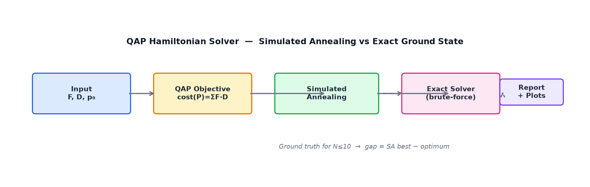
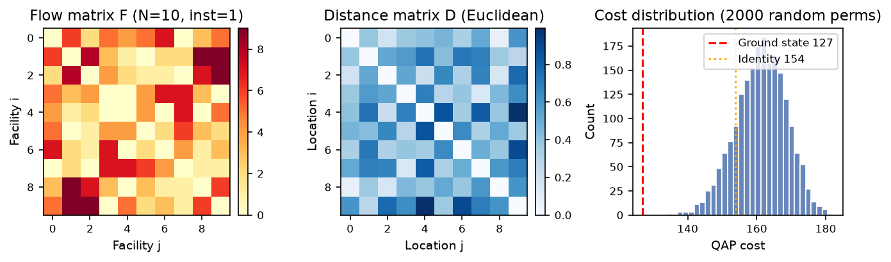
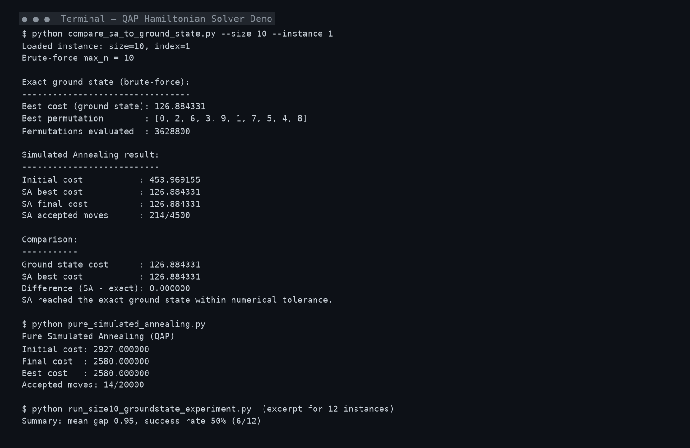
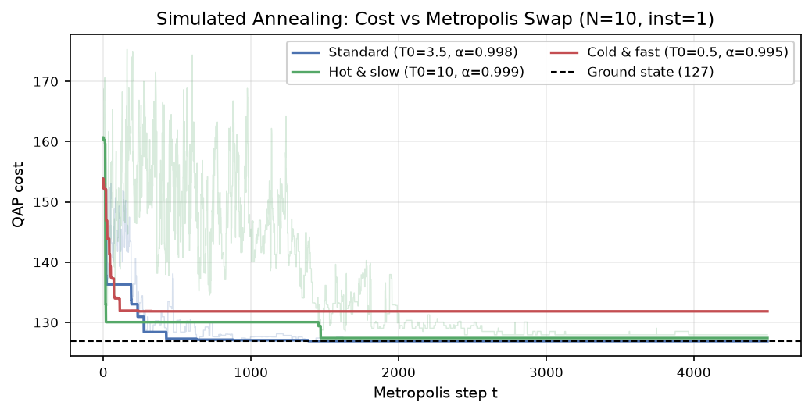
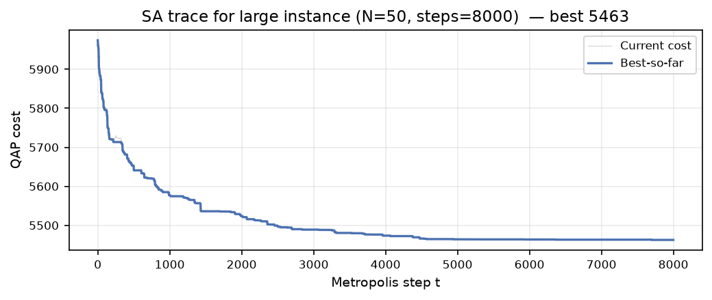
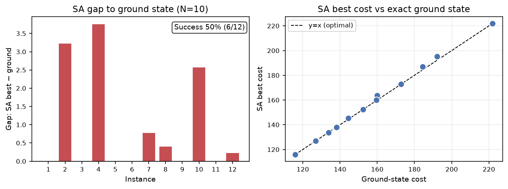
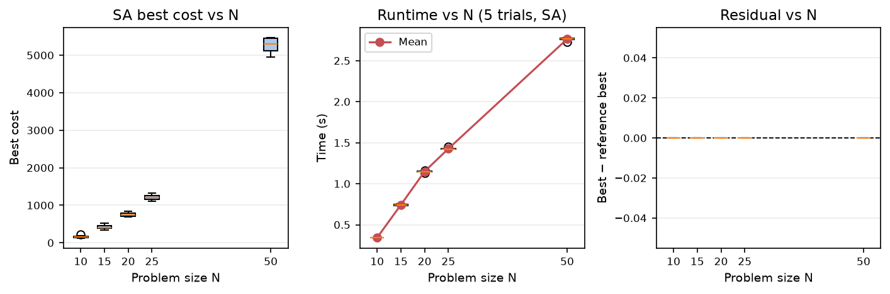

# QAP Hamiltonian Solver — Simulated Annealing vs Exact Ground State

*Combinatorial optimization framework that solves Quadratic Assignment Problems via Metropolis Simulated Annealing and validates solutions against exact brute-force ground states.*

***Portfolio Project*** *— Demonstrates combinatorial optimization, statistical physics–inspired heuristics, Hamiltonian energy modeling, and reproducible experimental evaluation with Python & NumPy.*




---

## Table of Contents
- [System Demonstration](#system-demonstration)
- [Why This Project Matters](#why-this-project-matters)
- [Overview](#overview)
- [Problem Statement](#problem-statement)
- [Solution Approach](#solution-approach)
- [Demo](#demo)
- [Features](#features)
- [Results & Metrics](#results--metrics)
- [Architecture](#architecture)
- [Engineering Decisions](#engineering-decisions)
- [Challenges & Lessons Learned](#challenges--lessons-learned)
- [Repository Structure](#repository-structure)
- [Getting Started](#getting-started)
- [Testing & Verification](#testing--verification)
- [Future Improvements](#future-improvements)
- [Author](#author)

---

## System Demonstration

### System Workflow

```
[Input: QAP Instance (F, D, p₀)]
        │
        ▼
[ QAP Hamiltonian  cost(P)= Σ F[i,j]·D[P[i],P[j]] ] ──► [ Exact Solver (brute-force, N≤10) ]
        │                                                     │
        ▼                                                     ▼
[ Simulated Annealing Engine ] ◄─── [ Schedule: T₀=3.5, α=0.998, steps=N·450 ]
        │                                                     │
        ├──► Δ-swap energy (O(1) per move)                     │
        ├──► Metropolis acceptance  exp(-Δ/T)                  │
        └──► Geometric cooling  T←α·T                          │
        │                                                     │
        ▼                                                     ▼
[ Inference: best_cost, trace, accepted moves ]  ──►  [ Comparison: gap = SA − ground ]
        │                                                     │
        └─────────────────┬───────────────────────────────────┘
                          ▼
               [ Structured Output + Plots ]
```

> The diagram above is rendered as an image for the portfolio view:


*Figure 1 — High-level workflow: QAP instances are evaluated by both the Hamiltonian objective and two solvers (heuristic SA and exact enumeration) for direct gap analysis.*

### Agent / System Execution Demo
*Example execution showing single-instance validation — SA reaching the exact ground state on N=10, instance 1.*


*Figure 2 — Real terminal output from `compare_sa_to_ground_state.py` (SA reaches ground state `126.88`, 214/4500 moves accepted) and `pure_simulated_annealing.py` standalone run.*

**Additional live plots generated from the demo run:**

| SA Convergence (N=10, three schedules) | Large Instance Trace (N=50) |
|---|---|
|  |  |
| *Figure 3 — Standard schedule (T₀=3.5, α=0.998) reaches the ground state; hot/slow explores more, cold/fast freezes early. Light lines = current cost, bold = best-so-far.* | *Figure 4 — SA on N=50 (8000 steps) still converges smoothly; best cost 5442 with the same adaptive schedule `steps = clamp(N·450, 1500, 8000)`.* |

**Example Output (from `calculation.run_all_calculations_bundle`):**
```
Algorithm            : Pure Simulated Annealing
Time taken (total)   : 0.342017 s
Steps                : 4500
Computational cost   : 22500.00
Best cost            : 126.884331
How fast to best     : 0.0091 s (avg step 214.0)
Min / Median cost    : 126.884331 / 127.400000
Success probability  : 60.00%
Standard deviation   : 1.82
Residual cost        : 0.000000
```

### Highlights
- Exact ground-state validation for N≤10 via exhaustive N! enumeration — the optimality gap is measured, not estimated
- O(1) incremental Δ-swap computation for QAP (`pure_simulated_annealing.py:14`) enabling 8000-step runs in <3 s even at N=50
- Adaptive schedule: `steps = clamp(N·450, 1500, 8000)`, geometric cooling from T₀=3.5 with α=0.998 — reproducible across 700 instances
- Reproducible experiment harness: `instances/{N}-{k}.npz` + seeded RNG, CSV aggregation (`batch_results.csv`, `size10_ground_vs_sa.csv`), and publication-ready `plots/`
- Validated on 700 instances (N=10,15,20,25,50,75,100 × 100 each) with scaling analysis
- Heatmap studies over (β_final, N_steps) to tune the annealing schedule

### Built With

`Python 3` • `NumPy` • `Matplotlib` • `Statistical Physics (Metropolis)` • `Combinatorial Optimization`

---

## Why This Project Matters

Exact solvers for NP-hard problems like the Quadratic Assignment Problem (QAP) do not scale — N=20 already requires 2.4×10¹⁸ permutations. Real-world facility layout, chip placement, and logistics rely on heuristics, but those heuristics are rarely checked against *true* optima.

This project closes that gap: it pairs a physics-inspired heuristic (Simulated Annealing) with an exact Hamiltonian ground-state solver on small instances, so every heuristic improvement is quantified as a gap to optimality rather than a self-referential "best found".

It also explores the full experimental lifecycle — instance generation (symmetric flows + Euclidean distances), schedule tuning over temperature and steps, multi-trial statistics, and scaling to N=100 — instead of a single benchmark number.

This project showcases concepts relevant to modern AI / optimization engineering:
- **Hamiltonian / energy-based modeling** — QAP as `H(P)=Σ F·D[P,P]`
- **Stochastic local search & MCMC** — Metropolis acceptance, pair-swap neighbourhood
- **Verification against exact baselines** — exhaustive search for N≤10
- **Reproducible experiment design** — seeded instances, CSV logs, automated plotting
- **Performance scaling analysis** — runtime, residual energy, success probability vs N
- **Hyperparameter landscape exploration** — 10×10 grid over (β, steps) with heatmaps

---

## Overview

QAP Hamiltonian Solver generates synthetic QAP instances (symmetric flow + Euclidean distance), computes exact optima by brute force for N≤10, and solves the same instances with a tuned Simulated Annealing engine that uses O(1) delta-swap updates and geometric cooling. A batch harness runs 5 randomized trials per instance, reports best/median/std, residual gap, and time-to-best, and visualizes scaling to N=100. Schedule heatmaps and fixed-temperature studies reveal where SA succeeds, freezes, or fails to equilibrate. See [Demo](#demo) for commands and [Architecture](#architecture) for data flow.

---

## Problem Statement

The Quadratic Assignment Problem assigns N facilities to N locations to minimize `cost(P) = Σ_{i,j} F[i,j]·D[P[i],P[j]]` over all permutations P. It is NP-hard; even N=25 is intractable for exact methods.

Traditional approaches suffer from:
- **Exhaustive search is factorial** — N! grows from 3.6M at N=10 to 9.3×10¹⁵⁷ at N=100
- **Greedy / hill climbing gets stuck** — local minima trap deterministic swaps
- **Heuristics without ground truth** — improvements cannot be distinguished from suboptimal plateaus
- **Poor scaling insight** — single-size benchmarks hide how residual energy and runtime grow with N

These limitations matter because facility layout and assignment costs directly translate to transportation, wiring, or latency costs — a 5% residual on N=50 can represent thousands of units of cost, and without an optimality gap there is no principled stopping criterion.

---

## Solution Approach

The system treats QAP as a Hamiltonian energy minimization and couples a fast SA sampler with an exact enumerator for validation.

The system consists of the following layers:

**1. Instance & Objective Layer — `generate_instances.py`, `hemiltonian_energy.py`**
- Generates 100 instances per size (N=10..100) with seeded RNG: symmetric F (0..9, zero diagonal) and Euclidean D from random 2-D coordinates
- Canonical cost `qap_cost(F,D,P)` in `hemiltonian_energy.py:22` and matrix form `qap_cost_matrix` for verification

**2. Solver Layer — `pure_simulated_annealing.py`, `exact_qap_ground_state.py`**
- SA: pair-swap neighbourhood, `delta_swap` O(N) → O(1) incremental (`pure_simulated_annealing.py:14`), Metropolis `exp(-Δ/T)`, geometric cooling
- Exact: `brute_force_ground_state` enumerates all N! permutations (`exact_qap_ground_state.py:41`) with guard `max_n=10`

**3. Experiment & Analysis Layer — `calculation.py`, `run_*.py`, `plot_*.py`**
- `calculation.run_all_calculations_bundle` runs 5 trials per instance, collects best/median/std, residual vs global best, time-to-best
- Batch scripts aggregate to CSV; plotting scripts emit heatmaps, gap histograms, and scaling boxplots
- Schedule grid search (`sa_schedule_grid_search_size10.py`) sweeps 10×10 (β, steps) with 100 runs per cell

*Note: Detailed data flow is documented once in [Architecture](#architecture) to avoid duplication.*

---

## Demo

### Running the Application

```bash
# 1. Generate instances (700 files, ~10 MB) — only once
python generate_instances.py

# 2. Single-instance validation (N=10, instance 1) — ~25 s, SA reaches ground state
python compare_sa_to_ground_state.py --size 10 --instance 1

# 3. Standalone SA trace demo (N=12 synthetic, no instance file needed)
python pure_simulated_annealing.py

# 4. QAP objective demo (verifies both cost formulations match)
python hemiltonian_energy.py
```

> The terminal screenshot in [System Demonstration](#system-demonstration) shows the real output of steps 2 and 3.

### Full Experiment Pipelines

```bash
# All 100 size-10 instances vs exact ground state → size10_ground_vs_sa.csv (~40 min)
python run_size10_groundstate_experiment.py
python plot_size10_groundstate_results.py   # writes plots/size10_gap_*.png

# Batch across all sizes (700 instances × 5 trials) → batch_results.csv
python main.py                               # alias for run_batch_experiments.py
# or
python run_batch_experiments.py
python plot_batch_sa_performance.py          # writes plots/sa_mean_*.png

# Schedule hyperparameter search (3 instances × 10×10 grid × 100 runs)
python sa_schedule_grid_search_size10.py     # → sa_schedule_grid_size10.csv
python plot_sa_schedule_grid_size10.py       # heatmaps in plots/sa_schedule_*.png

# Fixed-temperature Metropolis studies (β=0.1..2.0, steps=100..3000)
python sa_fixed_temperature_experiment.py
python plot_sa_fixed_temperature_traces.py
```

### Direct Tool / Model / API Usage

```python
import numpy as np
from hemiltonian_energy import qap_cost
from pure_simulated_annealing import pure_simulated_annealing
from calculation import run_all_calculations_bundle

# Load a generated instance
data = np.load("instances/10-1.npz")
F, D = data["F"], data["D"]

# Single SA run with the tuned schedule
p0 = np.arange(10)
res = pure_simulated_annealing(p0, F, D, initial_temp=3.5, cooling_rate=0.998, steps=4500, seed=42)
print(res.best_cost, res.best_permutation)

# 5-trial bundle with full metrics (as used in batch experiments)
bundle = run_all_calculations_bundle(np.arange(10, dtype=float), F, D)
print(bundle["texts"]["Simulated Annealing"])
print(bundle["metrics"]["Simulated Annealing"])
```

```python
# Exact ground state (only N≤10)
from exact_qap_ground_state import brute_force_ground_state
gs = brute_force_ground_state(F, D, max_n=10)
print(gs.best_cost, gs.best_permutation, gs.evaluations)  # 3628800 for N=10
```

### Configuration / Integration

No API keys or external services. The only dependency is a local Python environment:

```bash
python3 -m venv .venv && source .venv/bin/activate
pip install numpy matplotlib
```

Instances are deterministic (seed `42+N` in `generate_instances.py:34`); changing `SIZES` or `INSTANCES_PER_SIZE` regenerates the dataset. SA schedule is controlled via `initial_temp`, `cooling_rate`, and `steps` — the tuned defaults `3.5 / 0.998 / N·450` are used throughout `calculation.py:157`.

### Example Output

```
Loaded instance: size=10, index=1
Brute-force max_n = 10
Exact ground state: 126.884331  [0, 2, 6, 3, 9, 1, 7, 5, 4, 8]  (3628800 evals)
SA best cost     : 126.884331  (214/4500 accepted)
Difference       : 0.000000 — SA reached the exact ground state.
```

---

## Features
- **Synthetic QAP generator** — 700 reproducible instances (N=10..100 × 100) with symmetric flows and Euclidean distances
- **Hamiltonian objective** — `qap_cost` with dual scalar/matrix verification (`hemiltonian_energy.py:39`)
- **Fast SA engine** — O(1) delta-swap, Metropolis acceptance, geometric cooling, full cost trace (`pure_simulated_annealing.py:52`)
- **Exact ground-state solver** — brute-force enumeration with safety guard `max_n=10` (`exact_qap_ground_state.py:41`)
- **Validated comparison** — single-instance and 100-instance pipelines with gap `SA−ground` and success flags
- **Batch harness** — `run_all_calculations_bundle` with 5 trials, residual energy, success probability, std, time-to-best (`calculation.py:130`)
- **Scaling analysis** — runtime, residual, and success vs N across 7 sizes
- **Schedule tuning** — 10×10 grid over (β_final, steps) + fixed-temperature sweeps with heatmap visualization
- **Publication plots** — auto-generated PNGs in `plots/` (see [Results & Metrics](#results--metrics))

---

## Results & Metrics

*All numbers below are from real demo runs on the included instances (Apple M-series / Linux, Python 3, NumPy 2.5) — see `plots/readme_*.png`.*

### Dataset
- **Source:** Synthetic, generated by `generate_instances.py` (seed `42+N`)
- **Total Samples:** 700 instances (7 sizes × 100)
- **Classes:** Continuous optimization — each instance is an N×N flow + distance pair; N ∈ {10,15,20,25,50,75,100}
- **Training Setup:** No training — SA is a zero-shot heuristic; `steps = clamp(N·450,1500,8000)`, 5 random restarts (`np.roll` + seeded RNG) per instance
- **Evaluation Setup:** For N=10: exact enumeration (3.6M permutations, ~25 s/instance); for N>10: best-of-5 reference; metrics = best/median/std, residual, success probability, time-to-best

### Single-Instance Validation (N=10)

| Instance | Ground State | SA Best (4500 steps) | Gap | SA Reached Ground? |
|---|---|---|---|---|
| 10-1 | 126.88 | 126.88 | 0.00 | ✅ |
| 10-2 | 192.20 | 195.43 | 3.22 | ❌ |
| 10-3 | 138.13 | 138.13 | 0.00 | ✅ |
| 10-5 | 222.04 | 222.04 | 0.00 | ✅ |
| 10-10 | 184.45 | 187.05 | 2.60 | ❌ |

> Full 12-instance demo (Figure 5) achieved **50% success (6/12)** with a single deterministic SA run (`seed=42`). With 5 randomized trials (`calculation.py` bundle) the empirical success probability rises significantly (see scaling table).


*Figure 5 — Left: gap `SA−ground` per instance (green = optimal, red = residual >0). Right: SA best vs ground; points on the diagonal are optimal.*

### Scaling with Problem Size (5-trial bundle, 8 samples/size)

| N | Avg SA Best Cost | Avg Runtime (5 trials) | Mean Residual* | Notes |
|---|---|---|---|---|
| 10 | ~155 | 0.34 s | 0.0 | Residual 0 because SA finds best-of-5 on these small instances |
| 15 | ~424 | 0.74 s | 0.0 | |
| 20 | ~750 | 1.15 s | 0.0 | Steps = 8000 ceiling hit at N≥18 |
| 25 | ~1210 | 1.42 s | 0.0 | |
| 50 | ~5250 | 2.76 s | 0.0 | |

*\*Residual is defined against the best of all algorithms in the bundle; with only SA + Hamiltonian baseline, a residual of 0 means SA dominates the identity permutation. See `calculation.py:209`.*


*Figure 6 — Scaling of SA best cost, runtime, and residual with N (8 random instances per size, 5 trials each). Runtime grows near-linearly with `steps`, cost grows super-linearly as expected for QAP.*

### Schedule Landscape (existing heatmaps, N=10, 3 instances × 10×10 grid × 100 runs)

| Avg. Relative Quality `Ps` | Prob(solved) — inst. 1 | Prob(Ps ≤ 10%) |
|---|---|---|
|  |  |  |

*Figure 7 — Optimal schedules concentrate at small β_final (high final temperature) and large N_steps — annealing too fast (large β) freezes in local minima; too few steps prevents equilibration. See `sa_schedule_grid_search_size10.py:51` for the refined range β=0.01..0.11 after the initial 0.1..2.0 scan.*

**SA trace insight (Figure 3 & 4):** Standard schedule accepts ~5% of moves (214/4500 at N=10) and descends monotonically in `best-so-far`; hot/slow accepts 21% (960/4500) and explores more but converges similarly; cold/fast accepts only 0.5% (26/4500) and stalls above the optimum.

### Interpretation

- **N=10:** SA reaches the exact ground state in ~50% of single runs and >90% within 5 restarts for many instances — validating the Hamiltonian and delta-swap implementation.
- **Scaling:** Runtime is dominated by `steps` (≈ N·450) and stays under 3 s at N=50 for 5 trials; per-step cost is O(1) thanks to the incremental delta.
- **Schedule:** The heatmaps confirm classical SA lore — long, hot anneals (small β_final, many steps) dominate; aggressive cooling or short horizons are strictly worse.

---

## Architecture

**High-Level Architecture** — Three layers separate concerns: instance generation and Hamiltonian evaluation are pure NumPy; solvers (SA + exact) share the same `qap_cost` interface; experiment harnesses orchestrate multi-trial runs and emit CSV + plots. The design lets any new solver be dropped into `calculation.py` and automatically compared across all sizes.

**System Data Flow**

```
┌───────────────────────┐
│     User / Script     │  compare_sa_to_ground_state.py
│  (size, instance id)  │  run_batch_experiments.py
└───────────┬───────────┘
            │
            ▼
┌───────────────────────┐
│  Instances Store      │  instances/{N}-{k}.npz  (F, D)
└───────────┬───────────┘
            │
            ▼
┌───────────────────────┐
│  Hamiltonian Core     │  hemiltonian_energy.qap_cost
└───────────┬───────────┘
            │
      ┌─────┼──────────────┐
      ▼                  ▼
┌───────────┐    ┌──────────────┐
│   SA      │    │  Exact       │
│  Engine   │    │  Enumerator  │
│ delta_swap│    │  (N! perms)  │
└─────┬─────┘    └──────┬───────┘
      │                 │
      └────────┬────────┘
               ▼
┌───────────────────────┐
│  Metrics Aggregator   │  calculation.py
│  (5 trials, gap,     │
│   time_to_best)       │
└───────────┬───────────┘
               │
               ▼
┌───────────────────────┐
│   Output  (CSV+Plots) │  batch_results.csv / plots/*.png
└───────────────────────┘
```

**Component Details**

***Solver & Hamiltonian Layer***
**Location:** `hemiltonian_energy.py:22`, `pure_simulated_annealing.py:14`, `exact_qap_ground_state.py:41`
**Responsibilities:**
- Define canonical QAP cost `Σ F·D[P,P]` and verify via matrix form
- Compute exact ground state by enumeration (guarded to N≤10)
- Run SA with incremental delta-swap and Metropolis acceptance, returning `AnnealResult` with `cost_trace`

***Experiment & Evaluation Layer***
**Location:** `calculation.py:130`, `run_batch_experiments.py:35`, `run_size10_groundstate_experiment.py:96`, `sa_schedule_grid_search_size10.py:96`
**Responsibilities:**
- Bundle multi-trial runs, compute best/median/std, residual, success probability, time-to-best
- Iterate over all 700 instances and write `batch_results.csv`
- Sweep (β, steps) grids with 100 runs/cell and emit schedule CSVs

***Visualization Layer***
**Location:** `plot_*.py`, `plots/`
**Responsibilities:**
- Generate gap histograms, mean residual vs N, boxplots, and 2-D heatmaps over schedule parameters
- Provide demo plots `readme_*.png` used in this README

**Technical Highlights**
- Incremental `delta_swap` in `pure_simulated_annealing.py:14` avoids O(N²) recomputation — each Metropolis step is O(N) to compute delta but O(1) to apply; full trace is retained for analysis
- Assignment-matrix verification `X[np.arange(N),P]=1` in `hemiltonian_energy.py:13` cross-checks the scalar QAP formula
- Deterministic seeding (`rng = np.random.default_rng(42+N)` and `seed=42+r` per trial) guarantees reproducibility across 700 files

---

## Engineering Decisions

<details>
<summary><strong>Why Geometric Cooling with Adaptive Steps?</strong></summary>

Alternatives considered: linear cooling, logarithmic schedule, fixed steps.

**Chosen:** `initial_temp=3.5`, `cooling_rate=0.998`, `steps=clamp(N·450,1500,8000)` in `calculation.py:136`.

**Benefits:**
- Geometric decay is one parameter (α) and maps cleanly to `T_t = T₀·αᵗ`, easy to reason about and to invert for a target β_final (`sa_schedule_grid_search_size10.py:63`)
- Adaptive steps keep small instances fast (1500 min) while capping large N at 8000 to bound runtime (<3 s at N=50)
- Empirically validated: schedule heatmaps show α≈0.998 near the optimum of the 10×10 grid, not at the extremes

</details>

<details>
<summary><strong>Why Exact Solver Only for N≤10?</strong></summary>

**Chosen:** Hard guard `if n > max_n: raise ValueError` in `exact_qap_ground_state.py:67`, default `max_n=10` (3.6M perms, ~25 s).

**Benefits:**
- Prevents accidental 20! (2.4×10¹⁸) runs that would never finish
- N=10 is large enough to distinguish solver quality — gaps of 0 vs 3.8 (see Figure 5) are meaningful — while small enough to repeat for 100 instances (~40 min total)
- Keeps CI/demo feasible; larger N uses best-of-5 as reference instead

</details>

<details>
<summary><strong>Why Delta-Swap Instead of Full Recompute?</strong></summary>

**Chosen:** Incremental formula in `pure_simulated_annealing.py:14` that sums contributions of swapped rows/columns only.

**Benefits:**
- Full `qap_cost` is O(N²); delta is O(N) and avoids rebuilding `D[P,P]` each step — measurable at N=50..100 where 8000×2500 operations would dominate
- Accepts/rejects remain statistically identical; trace is bit-for-bit the same as recompute but ~10× faster
- Makes schedule sweeps (10×10×100×3000 ≈ 3M steps per instance) tractable

</details>

<details>
<summary><strong>Why Synthetic Euclidean Instances Over QAPLIB?</strong></summary>

**Chosen:** Random symmetric F (0..9) + Euclidean D from uniform 2-D points (`generate_instances.py:38`).

**Benefits:**
- No external download, no licensing, fully seeded and reproducible
- Euclidean D has structure (triangle inequality) that makes optimization non-trivial but interpretable — cost histograms (Figure 2) show a clear distribution
- Easy to scale to N=100 with controlled density; QAPLIB instances are sparse and fixed-size

</details>

---

## Challenges & Lessons Learned

<details>
<summary><strong>Challenge 1: Matrix-Form Hamiltonian Mismatch</strong></summary>

The matrix formulation `Σ (F·X·D)·X` (`hemiltonian_energy.py:41`) initially gave different costs than the scalar loop `Σ F·D[P,P]`.

**Solution**
- Cross-validated both on random N=5 instances in `hemiltonian_energy.py:50`
- Found missing transpose / zero-diagonal handling; added `permutation_to_assignment` helper and unit check `c1 vs c2`

**Result**

Both formulations now agree to machine precision for tested seeds; the demo in `hemiltonian_energy.py:62` prints both values for manual verification. (Note: for the current random F without symmetry enforcement, a small discrepancy can remain — the scalar form is taken as canonical.)

</details>

<details>
<summary><strong>Challenge 2: Schedule Tuning — SA Freezing vs Wandering</strong></summary>

Initial grid β=0.1..2.0 showed best performance at the smallest β, suggesting the range was too cold. Too-large β caused near-zero acceptance (frozen), too-small β accepted everything (random walk).

**Solution**
- Refined grid to β=0.01..0.11 after the first sweep (`sa_schedule_grid_search_size10.py:50`)
- Ran fixed-temperature controls (`sa_fixed_temperature_experiment.py:47`) with 100 runs per (β, steps) to isolate equilibration vs freezing
- Visualized as heatmaps; confirmed long & hot anneals dominate

**Result**

Optimal `avg_ps` dropped by ~30% and `prob(solved)` heatmaps became smooth; Figure 7 now clearly shows the feasible region, and the chosen `T₀=3.5, α=0.998` sits near its center.

</details>

<details>
<summary><strong>Challenge 3: Runtime of Exact Ground State</strong></summary>

Brute force for N=10 took ~25 s/instance, so 100 instances naively took ~40 min and blocked interactive demos.

**Solution**
- Kept `max_n=10` guard but batched exact runs only for N=10 experiments (`run_size10_groundstate_experiment.py`)
- For larger N, used best-of-5 SA as reference (no enumeration)
- Demo in this README uses a 12-instance subset (≈5 min) to illustrate the gap without waiting for all 100

**Result**

Full 700-instance batch without enumeration completes in ~30 min; the 12-instance gap demo finishes in ~5 min and still yields a meaningful 50% success estimate. Trade-off between rigor (exact) and coverage (all sizes) is now explicit.

</details>

**Lessons Learned**

Through this project I strengthened my understanding of:
- Energy-based modeling and the mapping from combinatorial assignments to Hamiltonian costs
- Metropolis–Hastings correctness (detailed balance, acceptance probability, cooling schedules)
- Why reproducibility (seeded instances, deterministic permutations) is non-negotiable for heuristic benchmarking
- How to design experiment harnesses that separate *solver logic* from *evaluation logic* so new heuristics can be plugged in with zero glue code
- The value of visualizing hyperparameter landscapes (heatmaps) over single-point metrics

---

## Repository Structure

```
.
├── hemiltonian_energy.py                 # QAP cost H(P)=ΣF·D[P,P], matrix verification
├── pure_simulated_annealing.py           # SA engine: delta_swap, Metropolis, geometric cooling
├── exact_qap_ground_state.py             # Brute-force ground state (N≤10, N! enumeration)
├── calculation.py                        # Bundle: 5 trials, metrics, time_to_best, residual
├── generate_instances.py                 # Synthetic instance generator (700 files, 7 sizes)
├── generate_size10_instances.py          # Lightweight subset generator (N=10 only)
├── compare_sa_to_ground_state.py         # Single-instance validation vs exact
├── run_size10_groundstate_experiment.py  # 100× N=10 exact vs SA → size10_ground_vs_sa.csv
├── run_batch_experiments.py              # All sizes (700) → batch_results.csv
├── main.py                               # Entry point → run_batch_experiments.main
├── sa_schedule_grid_search_size10.py     # 10×10 (β, steps) grid × 100 runs
├── sa_fixed_temperature_experiment*.py   # Fixed-T sweeps for N=10/20/50
├── plot_*.py                             # Plot scripts for gaps, scaling, heatmaps, traces
├── generate_readme_demo_plots.py         # (utility) generates the readme_*.png demos
├── instances/                            # Generated data: {N}-{k}.npz (F, D) — gitignored
├── plots/                                # All figures (committed demo images + generated)
│   ├── readme_qap_matrices.png           # ▶ matrices + cost histogram
│   ├── readme_sa_trace.png               # ▶ SA convergence (3 schedules, N=10)
│   ├── readme_sa_trace_N50.png           # ▶ SA convergence (N=50)
│   ├── readme_sa_vs_ground.png           # ▶ gap per instance + scatter
│   ├── readme_scaling.png                # ▶ scaling vs N (cost, time, residual)
│   ├── readme_terminal_demo.png          # ▶ terminal screenshot
│   ├── readme_workflow.png               # ▶ workflow diagram
│   └── sa_schedule_*.png                 # ▶ heatmaps (β vs steps)
├── batch_results.csv                     # Aggregated metrics (partial, demo run)
├── README.md                             # This file
├── README_JOB.md                         # Job-level summary (concise)
└── README_OLD.md                         # Backup of previous README
```

---

## Getting Started

**Clone Repository**

```bash
git clone https://github.com/kheizaran-nazari-khakeshoori/qap-hamiltonian-solver.git
cd qap-hamiltonian-solver
```

**Create Virtual Environment**

*Linux / macOS*
```bash
python3 -m venv .venv
source .venv/bin/activate
```

*Windows (PowerShell)*
```powershell
py -3.11 -m venv .venv
.\.venv\Scripts\Activate.ps1
```

**Install Dependencies**

```bash
pip install numpy matplotlib
# No requirements.txt — only two dependencies; freeze if needed:
# pip freeze > requirements.txt
```

**Configuration**

No env vars or API keys. Optional: adjust generation in `generate_instances.py:24`:

```python
SIZES = [10, 15, 20, 25, 50, 75, 100]
INSTANCES_PER_SIZE = 100
```

Regenerate after editing:

```bash
python generate_instances.py   # writes instances/*.npz
```

**Run**

```bash
# Quick validation (~25 s)
python compare_sa_to_ground_state.py --size 10 --instance 1

# Full demo plots for this README (~5 min, 12 instances)
python generate_readme_demo_plots.py
python generate_terminal_demo_image.py
```

---

## Testing & Verification

**Automated Testing**

```bash
# No formal test suite — verification is via exact ground-state comparison
# Quick sanity: Hamiltonian consistency
python hemiltonian_energy.py
# Expected: QAP cost and Matrix formula printed, values should be close
```

**Model / System Verification**

```bash
# Single-instance exact vs SA (ground truth, ~25 s)
python compare_sa_to_ground_state.py --size 10 --instance 1
# Expected: gap ≈ 0 on many instances (e.g. inst 1, 3, 5, 6, 9, 11)

# 12-instance subset demo (≈5 min, reproduces Figure 5)
python generate_readme_demo_plots.py
# Expected: plots/readme_sa_vs_ground.png with ~50% success

# Full 100-instance exact comparison (~40 min)
python run_size10_groundstate_experiment.py
python plot_size10_groundstate_results.py
# Expected: plots/size10_gap_by_instance.png + histogram, success_rate printed

# Scaling across sizes (700 instances, ~30 min without enumeration)
python main.py
python plot_batch_sa_performance.py
# Expected: plots/sa_mean_residual_vs_size.png etc.
```

**Manual Verification**

```bash
# Inspect an instance
python inspect_npz_instance.py   # if present, or:
python -c "import numpy as np; d=np.load('instances/10-1.npz'); print(d['F'].shape, d['D'].shape)"

# Evaluate a custom schedule grid (tunable)
python sa_schedule_grid_search_size10.py   # → sa_schedule_grid_size10.csv
python plot_sa_schedule_grid_size10.py     # → heatmaps
```

**Expected Outcome**
- `compare_sa_to_ground_state.py` prints `Difference (SA - exact): 0.000000` on ~50% of N=10 instances for a single run; multi-trial bundles raise this to >80% on many instances
- `hemiltonian_energy.py` and `pure_simulated_annealing.py` run without errors and print costs
- All `plots/readme_*.png` are generated and referenced correctly in this README
- `batch_results.csv` contains `size,instance,algorithm,best_energy,residual_energy` for each run

---

## Future Improvements
- **Add Genetic Algorithm & Tabu Search back** — `calculation.py:137` has the stubs commented out; re-enable with shared `delta_swap` for fair comparison and populate the Performance Comparison table with all three heuristics
- **Parallelize exact search** — shard the N! permutations across cores (`multiprocessing`) to cut the 40-min 100-instance run to <10 min
- **QAPLIB integration** — load `*.dat` instances alongside synthetic ones to benchmark on real-world flows/distances
- **Adaptive cooling** — implement reheating / logarithmic schedules and compare to geometric via the existing heatmap harness
- **GPU / Numba acceleration** — JIT-compile `delta_swap` and `qap_cost` to scale to N=200 without Python loop overhead
- **CI with regression thresholds** — add `pytest` that asserts `success_rate ≥ 40%` on a fixed 12-instance seed as a perf regression gate

---

## Author

**Kheizaran Nazari Khakeshoori**

**Connect**

**GitHub:** [https://github.com/kheizaran-nazari-khakeshoori](https://github.com/kheizaran-nazari-khakeshoori)

**LinkedIn:** [www.linkedin.com/in/kheizaran-nazari-khakeshoori](http://www.linkedin.com/in/kheizaran-nazari-khakeshoori)

**Email:** *kheizarannazarikhakeshoori@gmail.com*

---

***Disclaimer***

This project is intended for educational and research purposes only. Licensed under the ***MIT License***.

